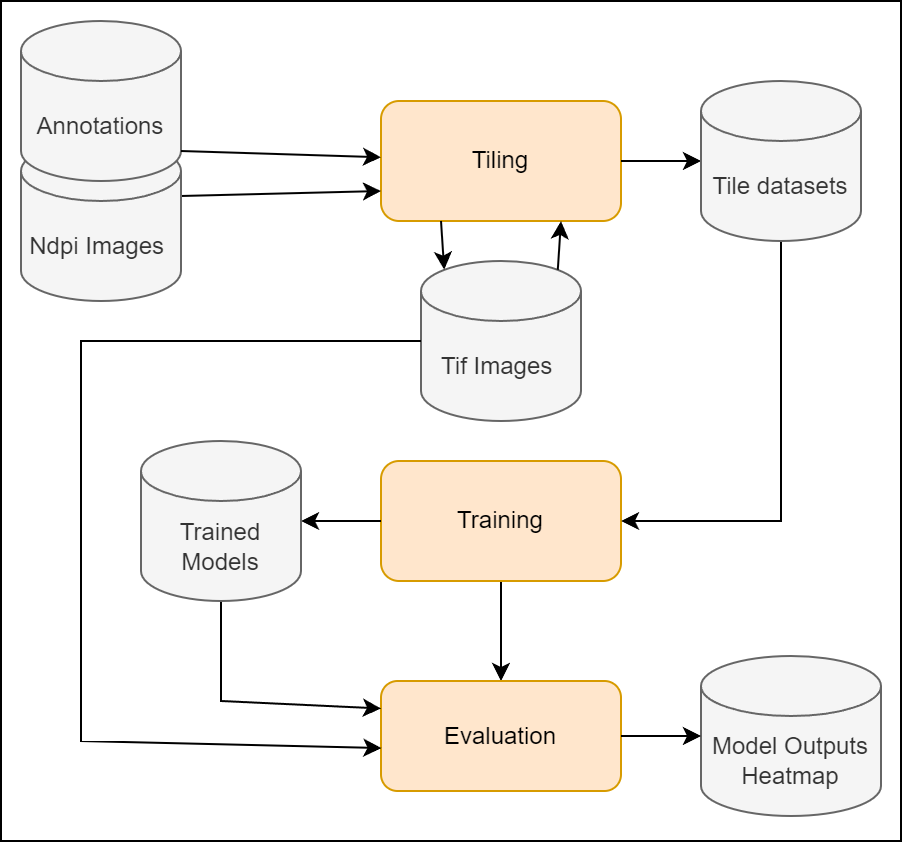
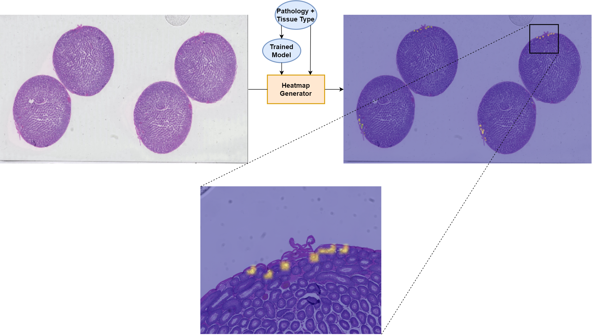

# Deep Histology Classification

Research on deep learning for histology. The full pipeline is used to decompose large tif histology slides into smaller images (tiles) that can be used for training a deep convolutional neural network which are then used to generate heatmaps of pathology hot spots on input images.

  

## Tiling

Tool that generates training tiles from images annotated using QuPath.
See `Tiling` directory.

## Training

Tool that is used to train deep convolutional nerual networks on a tile dataset
generated from the Tiling tool. Trained models are then used as input for 
the DHC tool. See `Training` directory.

## Evaluation

Tool that tiles a tissue image and uses a pre-trained deep learning
model to classify the tiles. See `Evaluation` directory.

  

## Acknowledgements

This work was supported by the John Templeton Foundation grant number 61174.
